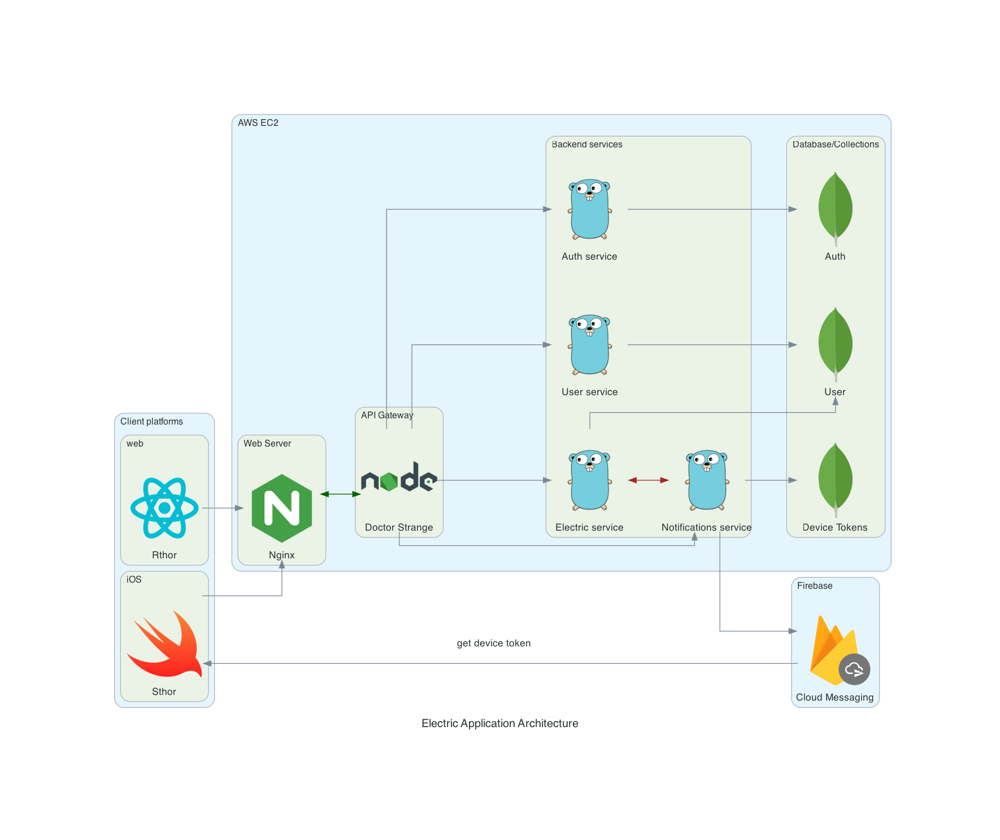

# electric-application

Electric application contains its own backend services, API gateway, frontend services. 

## Frontend services

### rthor - react thor (Private repo)

Web application to serve content built with NextJS, React

### Sthor - swift thor (Public repo)

iOS application to serve content built with Swift, SwiftUI

## Backend services

### electric-auth (Private repo)

Manages authentication & authorization for electric application written in Python, [FastApi](https://fastapi.tiangolo.com/) and [Supabase](https://supabase.com/auth)

### [electric-notifications](https://github.com/AnhCaooo/electric-push-notifications) (Public repo)

A service that responsible for dealing with notifications between mobile clients and servers

### [stormbreaker](https://github.com/AnhCaooo/stormbreaker) (Public repo)

Fetches electric prices in real time built with Golang

## Database services

### [electric-mongo](https://github.com/AnhCaooo/electric-mongo) (Public repo)

MongoDB service 

## [API gateway](https://github.com/AnhCaooo/doctor-strange) - Doctor-strange (Public repo)

Own custom API gateway service built with NodeJS

## electric-nginx Private repo
Nginx as web server and reverse proxy 

