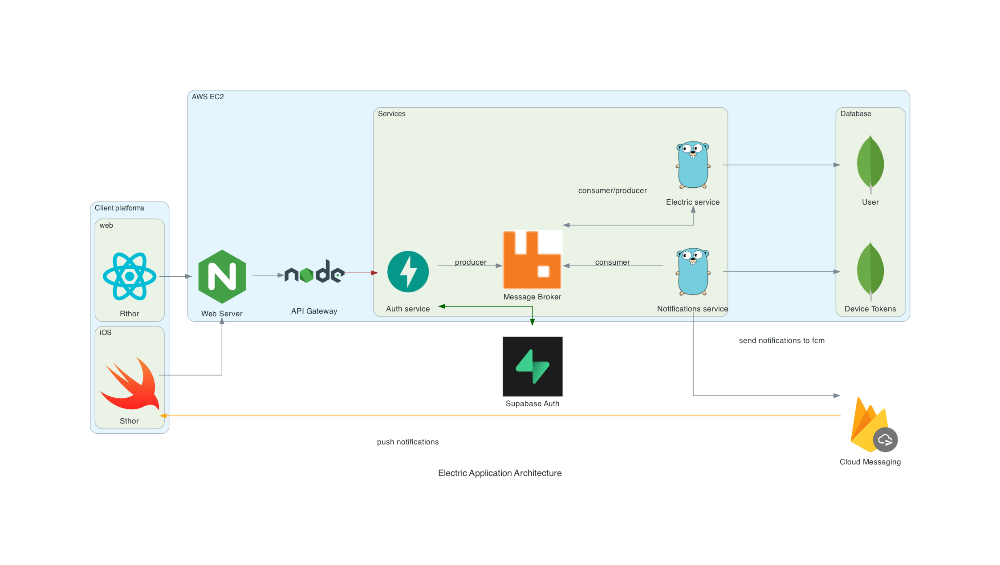

# electric-application

Electric application contains its own backend services, message broker, API gateway, frontend services. 

## Frontend services

### rthor - react thor (Private repo)

Web application to serve content built with NextJS, React

### Sthor - swift thor (Private repo)

iOS application to serve content built with Swift, SwiftUI

## Backend services

### electric-auth (Private repo)

Manages authentication & authorization for electric application written in Python, [FastApi](https://fastapi.tiangolo.com/) and [Supabase](https://supabase.com/auth)

### electric-notifications (Private repo)

A service that is responsible for dealing with notifications between mobile clients and servers

### electric-service (Private repo)

Fetches electric prices in real-time built with Golang

## Database services

### electric-mongo (Public repo)

MongoDB service 

## API gateway (Public repo)

Own custom API gateway service built with NodeJS

## electric-nginx (Private repo)
Nginx as web server and reverse proxy 

